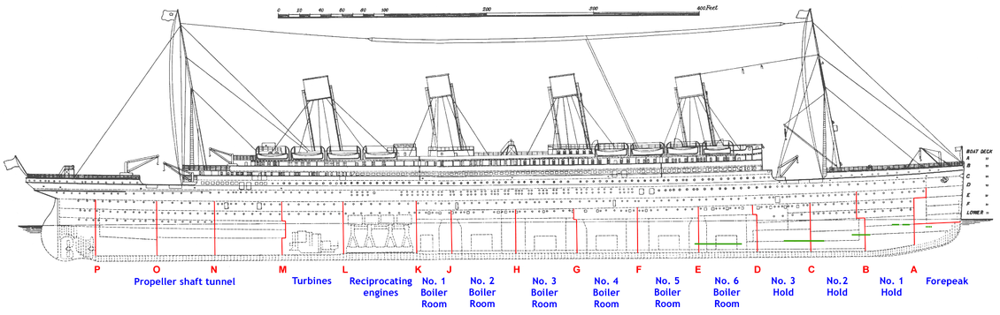

# (Fr)agile

#### How Agile Falls Apart (And What You Can Do to Keep it Together)

[fragile.seankilleen.com](https://fragile.seankilleen.com)

---
<!-- _footer: "" -->
<iframe
width="100%" height="100%"
src="https://www.youtube.com/embed/7Zw-BvKo0pI?rel=0&amp;controls=0&amp;showinfo=0&amp;start=0&end=30"
frameborder="0" allow="autoplay; encrypted-media" allowfullscreen>
</iframe>

---
<!-- _footer: "" -->

<iframe
width="100%" height="100%"
src="https://www.youtube.com/embed/5A0aXLtYPoE?rel=0&amp;controls=0&amp;showinfo=0&amp;start=28&end=60"
frameborder="0" allow="autoplay; encrypted-media" allowfullscreen>
</iframe>

---

# A Better Metaphor

<!-- 
Software projects are like a big ship
So what better metaphor than the titanic?
-->

---
<!-- _footer: "" -->

---

---

<!-- _footer: "" -->

# <!--fit--> Hi! :wave: I'm Sean

- :bird: [sjkilleen](https://twitter.com/sjkilleen)
- :earth_americas: [SeanKilleen.com](https://seankilleen.com)
- :briefcase: [Excella](https://excella.com)

<!-- "With a talk like that, you'd better have a good icebreaker." - Amanda -->
---

<!-- 
- Tech lead = informal agile coach
- I've seen some things
- Normally don't get to give these talks
- Excella has agile coaches; they have not signed off on this.
-->
---

---

---

---

---

#### Categories

# Delivery

---

#### Categories

# Growth

---

#### Categories

# Freedom

---

#### Categories

# Trust

---

#### Categories

# Vision

<!-- Transparency goes under trust; introspection goes under adaptation. -->

---

## Treating Process as the Enemy

| Delivery | Growth | Freedom | Trust | Vision |
| -------  | ----- | ------- | ------ | -------|
| :droplet: | | :droplet: | :droplet: | |

---

### :swimmer: Commit to a process

### :swimmer: Start where you are

### :swimmer: Process surfaces problems

### :swimmer: Process can be adapted

---

## Too Rigid Process

## (Oops)

| Delivery | Growth | Freedom | Trust | Vision |
| -------  | ----- | ------- | ------ | -------|
| :droplet: | | :droplet: | :droplet: | |

---

### :swimmer: Experiments

### :swimmer: Gradual Adaptation

### :swimmer: Reduced Pain = Buy-in

---

## "When will we be done?"

| Delivery | Growth | Freedom | Trust | Vision |
| -------  | ----- | ------- | ------ | -------|
| :droplet: | |  | :droplet: | :droplet: |

---

### :swimmer: Estimate &amp; Track

### :swimmer: Respect timeboxes

### :swimmer: You will run out; value first

---

## "Agile is Developers Being Lazy"

| Delivery | Growth | Freedom | Trust | Vision |
| -------  | ----- | ------- | ------ | -------|
|  | |  | :droplet: |  |

---

### :swimmer: Work not done == Savings

### :swimmer: Ruthless focus on value

### :swimmer: Slow is steady, steady is fast

### :swimmer: Play the long game

---

## PO Fiefdoms

| Delivery | Growth | Freedom | Trust | Vision |
| -------  | ----- | ------- | ------ | -------|
| :droplet:  | |  |  | :droplet: |

<!-- 
- Multiple backlogs
- Multiple stakeholders to please
- SMEs != POs
-->
---

### :swimmer: Find the true PO

### :swimmer: One Backlog

### :swimmer: Make stakeholders talk

---

## Dev Silos

| Delivery | Growth | Freedom | Trust | Vision |
| -------  | ----- | ------- | ------ | -------|
| :droplet:  | :droplet: |  |  |  |

---

### :swimmer: Pairing / Mobbing

### :swimmer: Knowledge sharing

### :swimmer: Dev Roundtable

### :swimmer: Prefer Teachers to Experts

---

## "Why are two devs working on this story?

| Delivery | Growth | Freedom | Trust | Vision |
| -------  | ----- | ------- | ------ | -------|
| :droplet:  | :droplet: | :droplet:  | :droplet:  |  |

---

### :swimmer: Demonstrate Cycle Time

### :swimmer: Educate

### :swimmer: Ask for Responsibility

---

## Quality Not Baked In

## Technical Debt

| Delivery | Growth | Freedom | Trust | Vision |
| -------  | ----- | ------- | ------ | -------|
| :droplet:  |  |   |   |  |

<!-- 
Testing as a phase
 Lack of automation
 Mini waterfall sprints
-->

---

### :swimmer: Focus on Automation

### :swimmer: Swiss Cheese Approach

### :swimmer: Estimate Debt Complexity

### :swimmer: Definition of Done

### :swimmer: Measure trends

---

## Authority vs. Leadership

| Delivery | Growth | Freedom | Trust | Vision |
| -------  | ----- | ------- | ------ | -------|
|   | :droplet: | :droplet:  | :droplet:  | :droplet: |

<!-- PO / SM as PM -->

---

### :swimmer: Common Goals / Charter

### :swimmer: Promote Divergent Thinking

### :swimmer: Lead by Example

---

## Not Enough Collaboration

| Delivery | Growth | Freedom | Trust | Vision |
| -------  | ----- | ------- | ------ | -------|
|  :droplet: | :droplet: |   |   |  |

---

### :swimmer: Get everyone in the same room

### :swimmer: Enable conversations

### :swimmer: Seek feedback

<!-- Three amigos, etc. -->

---

## Too Many Meetings

## (Oops)

| Delivery | Growth | Freedom | Trust | Vision |
| -------  | ----- | ------- | ------ | -------|
|  :droplet: | :droplet: |   | :droplet:  |  |

---

### :swimmer: Meetings with Purpose

### :swimmer: No Mandatory Attendance

### :swimmer: Radiate information

### :swimmer: Demand Presence

<!-- Book: Read this before our next meeting -->

---

## Stakeholder Time Constraints

| Delivery | Growth | Freedom | Trust | Vision |
| -------  | ----- | ------- | ------ | -------|
|  :droplet: | :droplet: |   |   |  |

---

### :swimmer: Definition of Ready

### :swimmer: Multiple Avenues of Feedback

### :swimmer: Make Sign-off Painless

---

## Lack of Conflict

| Delivery | Growth | Freedom | Trust | Vision |
| -------  | ----- | ------- | ------ | -------|
|   | :droplet: |   |  :droplet: |  |

<!--
Believe it or not, this is actually a bad thing.
 Conflict spectrum
 Radical Candor 
-->

---

### :swimmer: Model Receiving Feedback First

### :swimmer: Encourage Bold Retros

### :swimmer: Check-ins

### :swimmer: Embrace the uncomfortable

---

## Discouraging Slack Time

| Delivery | Growth | Freedom | Trust | Vision |
| -------  | ----- | ------- | ------ | -------|
| :droplet:  | :droplet: | :droplet:  |  :droplet: |  |

---

### :swimmer: Make spikes visible

### :swimmer: Showcase Risk Reduction

### :swimmer: Keep a list of wins

<!-- Wins: things that the client may not think of but that spikes helped with -->

---

## Large Feedback Loops

| Delivery | Growth | Freedom | Trust | Vision |
| -------  | ----- | ------- | ------ | -------|
| :droplet:  | :droplet: |   |  | :droplet: |

---

### :swimmer: Identify Cycles

### :swimmer: Maximize Improvement Chances

---

## Big Bang Deployments

| Delivery | Growth | Freedom | Trust | Vision |
| -------  | ----- | ------- | ------ | -------|
| :droplet:  |  |   |  | :droplet: |

---

### :swimmer: Create pipelines

### :swimmer: Always. Be. Deploying

### :swimmer: Insist on an env. for feedback

### :swimmer: Integrate early

---

## Unsustainable Pace

| Delivery | Growth | Freedom | Trust | Vision |
| -------  | ----- | ------- | ------ | -------|
| :droplet:  |  | :droplet:  |  | :droplet: |

---

### :swimmer: Estimate

### :swimmer: Link to Risk / Debt

### :swimmer: Velocity != Value

<!-- Comic: Technical debt cave / water -->

---

## Too much "on the right"

| Delivery | Growth | Freedom | Trust | Vision |
| -------  | ----- | ------- | ------ | -------|
| :droplet:  |  |   | :droplet: |  |

---

### :swimmer: Definition of Ready

### :swimmer: Specification by Example

### :swimmer: Consensus is key

### :swimmer: Automate it

---

## Underestimating Complexity

| Delivery | Growth | Freedom | Trust | Vision |
| -------  | ----- | ------- | ------ | -------|
| :droplet:  |  | :droplet:  | :droplet: |  |

---

### :swimmer: Point for debt

### :swimmer: Team Decides Points

### :swimmer: Velocity is an output

### :swimmer: The points aren't the point

---

## Large Chunks of Work

| Delivery | Growth | Freedom | Trust | Vision |
| -------  | ----- | ------- | ------ | -------|
| :droplet:  |  |   |  |  |

---

### :swimmer: Specification by Example

### :swimmer: Understand value first

### :swimmer: Perfect is the enemy

### :swimmer: Let points be your guide

---

## Team Stops Improving

| Delivery | Growth | Freedom | Trust | Vision |
| -------  | ----- | ------- | ------ | -------|
|   | :droplet: |   |  | :droplet: |

---

### :swimmer: Team introspection is key

### :swimmer: Everything is an experiment

### :swimmer: Psychological safety

---

## Velocity Obsession

| Delivery | Growth | Freedom | Trust | Vision |
| -------  | ----- | ------- | ------ | -------|
| :droplet:  | :droplet: |   |  | :droplet: |

---

### :swimmer: Velocity = Speed + Direction

### :swimmer: Impact maps

### :swimmer: Release themes

---

## Forgetting to Celebrate

| Delivery | Growth | Freedom | Trust | Vision |
| -------  | ----- | ------- | ------ | -------|
|   | :droplet: |   | :droplet: | :droplet: |

---

### :swimmer: Release celebration

### :swimmer: Weekly / monthly award

### :swimmer: Wall of Wins

### :swimmer: Call out Achievements

---

## Micromanagement

| Delivery | Growth | Freedom | Trust | Vision |
| -------  | ----- | ------- | ------ | -------|
|  :droplet: | :droplet: | :droplet:  | :droplet: | :droplet: |

---

### :swimmer: Understand driving concerns

### :swimmer: Ask for space

### :swimmer: When you get it, *deliver*

---

## Culture of Fear

| Delivery | Growth | Freedom | Trust | Vision |
| -------  | ----- | ------- | ------ | -------|
|  :droplet: | :droplet: | :droplet:  | :droplet: | :droplet: |

---

### :swimmer: Empathy

### :swimmer: Consistency

### :swimmer: Ownership

### :swimmer: Long-term Commitment

---

# Remember

# First Principles

[AgileManifesto.org](https://agilemanifesto.org)

---
<!-- _footer: "" -->

---

<!-- _footer: "" -->

# <!--fit--> Thanks

- :bird: [sjkilleen](https://twitter.com/sjkilleen)
- :earth_americas: [SeanKilleen.com](https://seankilleen.com)
- :briefcase: [Excella](https://excella.com)
