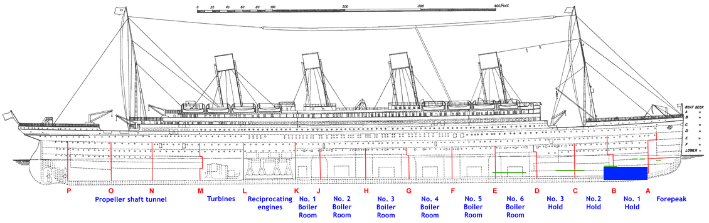
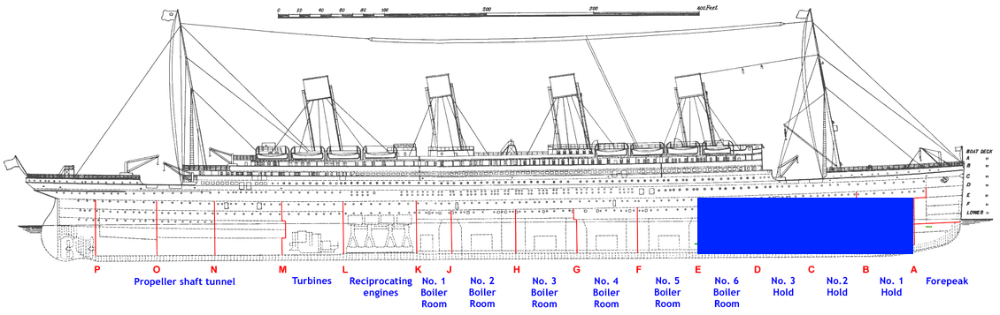
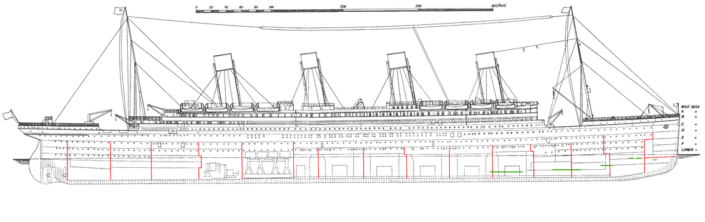

# (Fr)agile

## How Agile Falls Apart

#### (And what you can do to hold it all together)

[fragile.seankilleen.com](https://fragile.seankilleen.com)

---
<!-- _footer: "" -->
<iframe
width="100%" height="100%"
src="https://www.youtube.com/embed/7Zw-BvKo0pI?rel=0&amp;controls=0&amp;showinfo=0&amp;start=0&end=30"
frameborder="0" allow="autoplay; encrypted-media" allowfullscreen>
</iframe>

---
<!-- _footer: "" -->

<iframe
width="100%" height="100%"
src="https://www.youtube.com/embed/5A0aXLtYPoE?rel=0&amp;controls=0&amp;showinfo=0&amp;start=28&end=60"
frameborder="0" allow="autoplay; encrypted-media" allowfullscreen>
</iframe>

---

# A Better Metaphor

<!-- 
Software projects are like a big ship
So what better metaphor than the titanic?
-->

---
<!-- _footer: "" -->

---

---

<!-- _footer: "" -->

# <!--fit--> Hi! :wave: I'm Sean

- :bird: [sjkilleen](https://twitter.com/sjkilleen)
- :earth_americas: [SeanKilleen.com](https://seankilleen.com)
- :briefcase: [Excella](https://excella.com)

<!-- "With a talk like that, you'd better have a good icebreaker." - Amanda -->
---

<!-- 
- Tech lead = informal agile coach
- I've seen some things
- Normally don't get to give these talks
- Excella has agile coaches; they have not signed off on this.
-->
---

---

---

---

---

#### Categories

# Delivery

---

#### Categories

# Growth

---

#### Categories

# Freedom

---

#### Categories

# Trust

---

#### Categories

# Vision

<!-- Transparency goes under trust; introspection goes under adaptation. -->